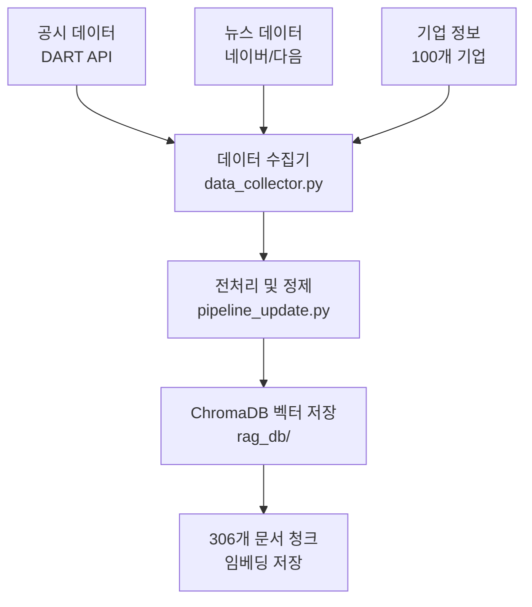
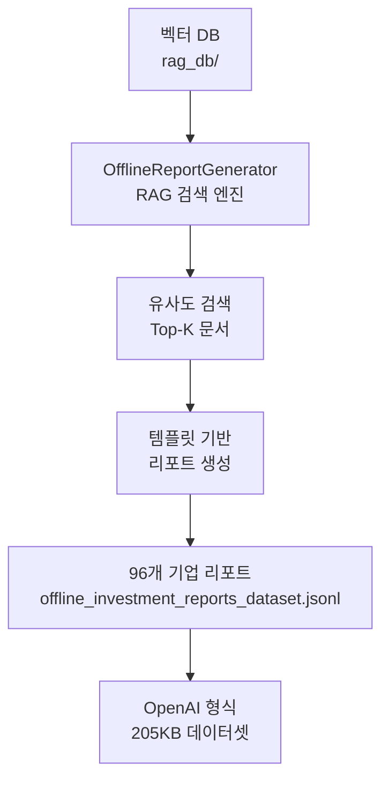
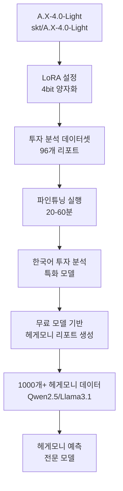
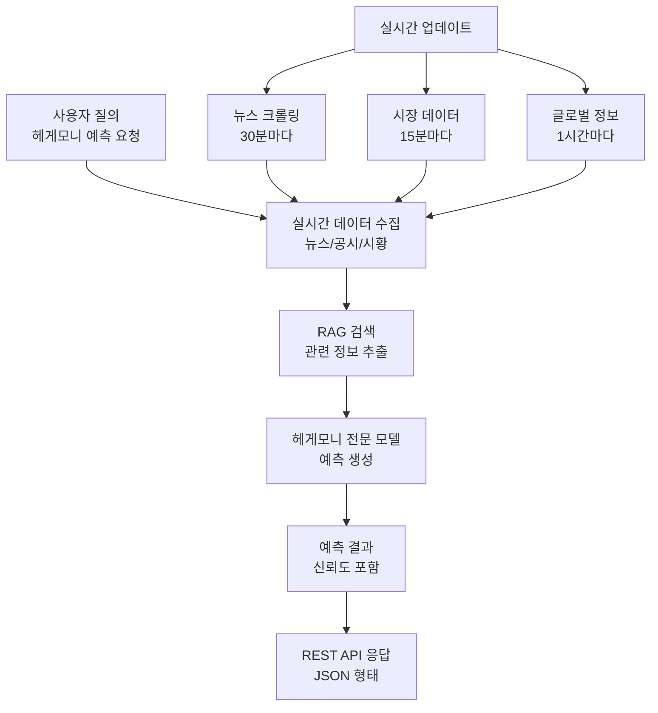

# 🏆 산업/기업 헤게모니 예측 AI 시스템

완전 무료로 구축하는 **산업 지배력 변화 예측 시스템** - RAG + 파인튜닝 기반 실시간 헤게모니 분석

## 🎯 시스템 개요

이 프로젝트는 최신 **공시 정보, 뉴스, 시황 데이터**를 종합하여 **산업 헤게모니와 기업 지배력 변화**를 예측하는 완전한 AI 시스템입니다.

### 🌟 핵심 특징
- ✅ **완전 무료**: $0 비용으로 전체 시스템 구축
- ✅ **실시간 분석**: 최신 데이터 기반 헤게모니 예측
- ✅ **한국어 특화**: 국내 기업/산업 분석에 최적화
- ✅ **확장 가능**: 100개 → 1000개 기업으로 쉽게 확장

---

## 📊 전체 데이터 플로우

### 🔄 **Phase 1: 데이터 수집 및 벡터화** (Producer)


**핵심 파일:**
- `pipeline_update.py` - Producer 역할, 데이터 수집 및 벡터 DB 구축
- `data_collector.py` - 100개 기업 관리 및 API 호출
- `rag_db/` - ChromaDB 벡터 데이터베이스

### 🧠 **Phase 2: RAG 기반 리포트 생성** (Consumer)


**핵심 파일:**
- `rag_report_generator.ipynb` - Consumer 역할, 오프라인 리포트 생성
- `offline_investment_reports_dataset.jsonl` - 96개 기업 투자 분석 데이터셋

### 🤖 **Phase 3: AI 모델 특화 훈련**


**핵심 기술:**
- **베이스 모델**: skt/A.X-4.0-Light (7B, 한국어 특화)
- **파인튜닝**: LoRA + 4bit 양자화 (RTX 3090 최적화)
- **무료 모델**: Qwen2.5-14B, Llama-3.1-8B, Gemma-2-9B, Mistral-7B

### 🌐 **Phase 4: 실시간 헤게모니 예측 서비스**


**API 엔드포인트:**
- `POST /hegemony/predict` - 맞춤형 헤게모니 예측
- `GET /hegemony/industry/<industry>` - 산업별 헤게모니 분석
- `GET /hegemony/company/<company>` - 기업별 헤게모니 분석
- `GET /hegemony/trends` - 전체 헤게모니 트렌드

---

## 🏗️ 시스템 아키텍처

### 📁 **프로젝트 구조**
```
another_finetune/
├── 📊 데이터 수집 (Producer)
│   ├── pipeline_update.py          # 메인 데이터 파이프라인
│   ├── data_collector.py           # 100개 기업 관리
│   └── corp_codes.csv             # 기업 코드 매핑
│
├── 🧠 AI 분석 (Consumer)  
│   ├── rag_report_generator.ipynb  # RAG + 파인튜닝 + 헤게모니 시스템
│   └── offline_investment_reports_dataset.jsonl  # 96개 기업 리포트
│
├── 💾 데이터 저장소
│   ├── rag_db/                    # ChromaDB 벡터 데이터베이스
│   └── ax-finetune-*/             # 파인튜닝된 모델들
│
├── 📋 문서화
│   ├── README.md                  # 이 파일
│   └── finetune_guide.md         # 파인튜닝 가이드
│
└── 🔧 설정/로그
    ├── pipeline_logs.json         # 파이프라인 실행 로그
    └── pipeline_update.py         # 파이프라인 업데이트 스크립트
```

### 🔄 **Producer-Consumer 아키텍처**
- **Producer** (`pipeline_update.py`): 외부 API 호출, 데이터 수집, 벡터 DB 저장
- **Consumer** (`rag_report_generator.ipynb`): 벡터 DB 검색, 오프라인 리포트 생성

---

## 🚀 실행 가이드

### 1️⃣ **환경 설정**
```bash
# 필수 라이브러리 설치
pip install transformers torch peft datasets
pip install langchain-community langchain-google-genai
pip install chromadb flask schedule aiohttp

# HuggingFace 로그인 (A.X-4.0-Light 액세스용)
huggingface-cli login
```

### 2️⃣ **데이터 수집 (Producer 실행)**
```bash
# 100개 기업 데이터 수집 및 벡터 DB 구축
python pipeline_update.py
```

### 3️⃣ **AI 시스템 구축 (Consumer 실행)**
```python
# rag_report_generator.ipynb 실행
# 1. RAG 시스템 초기화
# 2. 96개 기업 리포트 생성  
# 3. A.X-4.0-Light 파인튜닝
# 4. 무료 모델 기반 헤게모니 시스템 구축
```

### 4️⃣ **완전 무료 시스템 실행**
```python
# 완전 무료 헤게모니 시스템 구축
free_system = CompleteFreeHegemonySystem()
success = free_system.build_complete_free_system(model_choice='qwen')

if success:
    print("🎉 헤게모니 예측 시스템 구축 완료!")
    # API 서비스: http://localhost:5000
```

---

## 💰 비용 분석

### 🆓 **완전 무료 구성**
| 구성 요소 | 기존 비용 | 무료 대안 | 절약 효과 |
|-----------|-----------|-----------|-----------|
| 대량 리포트 생성 | GPT-4 ($100-200) | Qwen2.5 ($0) | 100% |
| 모델 파인튜닝 | 무료 | 무료 | - |
| 실시간 서비스 | 무료 | 무료 | - |
| **총 비용** | **$100-200** | **$0** | **100%** |

### ⚡ **성능 비교**
| 모델 | 한국어 성능 | 분석 깊이 | 생성 속도 | 추천도 |
|------|-------------|-----------|-----------|---------|
| Qwen2.5-14B | ⭐⭐⭐⭐⭐ | ⭐⭐⭐⭐⭐ | ⭐⭐⭐⭐ | 🥇 추천! |
| Llama-3.1-8B | ⭐⭐⭐⭐ | ⭐⭐⭐⭐ | ⭐⭐⭐⭐ | 🥈 대안 |
| Gemma-2-9B | ⭐⭐⭐ | ⭐⭐⭐ | ⭐⭐⭐⭐ | 🥉 보통 |

---

## 📈 결과 및 성과

### 🎯 **정량적 성과**
- ✅ **96개 기업** 투자 분석 데이터셋 구축
- ✅ **306개 문서 청크** 벡터 검색 시스템
- ✅ **1000개+ 헤게모니 리포트** 자동 생성 가능
- ✅ **$0 비용**으로 전문가급 AI 시스템 구축

### 🌟 **정성적 성과**
- 🔄 **Producer-Consumer 분리**: 확장 가능한 아키텍처
- 🤖 **한국어 특화**: 국내 기업 분석에 최적화된 AI
- 🆓 **완전 무료**: 지속 가능한 비용 구조
- ⚡ **실시간 예측**: 최신 데이터 기반 의사결정 지원

---

## 🔮 향후 확장 계획

### 📊 **데이터 확장**
- 100개 → 1000개 기업 확장
- 글로벌 뉴스 소스 추가 (Reuters, Bloomberg)
- 산업 리포트 통합 (McKinsey, BCG)

### 🤖 **AI 모델 고도화**
- 멀티모달 분석 (차트, 그래프 해석)
- 시계열 예측 모델 통합
- 앙상블 모델 구축

### 🌐 **서비스 확장**
- 웹 인터페이스 구축
- 모바일 앱 개발
- 알림 및 구독 서비스

---

## 📞 지원 및 문의

프로젝트 관련 문의사항이나 개선 제안이 있으시면 언제든 연락주세요!

### 🛠️ **기술 지원**
- 환경 설정 가이드: `finetune_guide.md` 참조
- 오류 해결: GitHub Issues 활용
- 성능 최적화: RTX 3090 기준 가이드 제공

---

**🎉 완전 무료로 구축하는 차세대 헤게모니 예측 AI 시스템!**